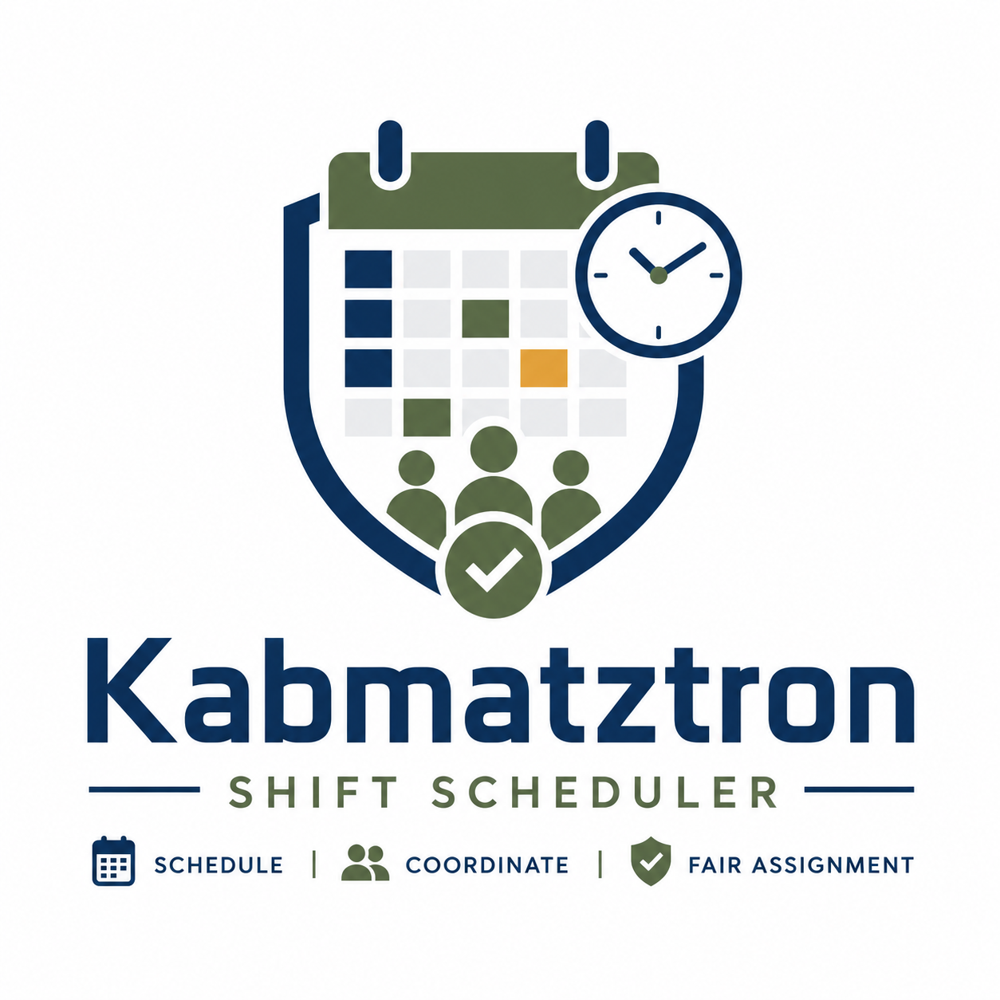

# Kabmatztron

<p align="center">
  
</p>

Kabmatztron is a Python-based shift scheduling system for assigning cadets to battalion duties.

The project is currently an MVP focused on reading structured input files, validating constraints, assigning cadets to shifts, and exporting the resulting schedule as readable Excel tables.

## What the project does

Kabmatztron assigns cadets to required shifts while enforcing hard constraints and trying to keep the workload fair between individuals.

The system is designed for schedules that include:

- Guarding shifts
- Cleaning shifts
- Standby-team duties
- Ceremony guarding
- Ceremony missions
- Other configurable job types

The job types are not hardcoded. They are defined by the input files, so the same system can be reused for different scheduling needs.

## Core goals

The MVP should:

- Read cadet data from a CSV file
- Read job definitions from a JSON file
- Read job compatibility rules from a constraints file
- Validate the input before solving
- Assign every required shift to one cadet
- Enforce all hard constraints
- Balance workload between cadets as fairly as possible
- Export the result to an Excel file
- Color cadet names by team/platoon combination in the output

## Scheduling model

A shift is modeled as a combination of:

```text
Job × Time Slot
```

For example:

```text
Job: Gate Guard 1
Job type: guarding
Time slot: 2026-06-01 08:00-2026-06-01 12:00
Difficulty: 4
Assigned cadet: David Cohen
```

Each job/time-slot combination should receive exactly one cadet.

If a real-world duty requires two cadets at the same time, it should be modeled as two separate jobs.

## Input files

### 1. Cadets CSV

The cadets CSV contains one row per cadet.

The primary key is the cadet's personal number.

Expected columns:

| Column | Description |
|---|---|
| `personal_number` | Unique military/personal ID |
| `name` | Cadet name |
| `unavailable_hours` | Time ranges where the cadet cannot participate |
| `forbidden_jobs` | Jobs the cadet cannot take |
| `gender` | Cadet gender |
| `team` | Cadet team |
| `platoon` | Cadet platoon |

`gender`, `team`, and `platoon` are not used as scheduling constraints in the MVP.

`team` and `platoon` are used for output coloring.

### 2. Jobs JSON

The jobs JSON defines the jobs, their job types, their time slots, and the difficulty of each job/time-slot combination.

Example:

```json
{
  "Gate Guard 1": {
    "job_type": "guarding",
    "difficulty_by_time_slot": {
      "2026-06-01 08:00-2026-06-01 12:00": 4,
      "2026-06-01 12:00-2026-06-01 16:00": 5
    }
  },
  "Cleaning Hallway": {
    "job_type": "cleaning",
    "difficulty_by_time_slot": {
      "2026-06-01 08:00-2026-06-01 12:00": 2,
      "2026-06-01 12:00-2026-06-01 16:00": 3
    }
  }
}
```

Difficulty scores are numeric values from `1` to `10`.

```text
1 = easiest
10 = hardest
```

Difficulty should reflect factors such as time of day, unpleasantness, night shifts, holidays, or whether the duty is done alone.

### 3. Job constraints file

The constraints file defines which job types may overlap and which job types may be assigned consecutively.

Possible CSV structure:

| job_type_a | job_type_b | can_overlap | can_be_consecutive |
|---|---|---:|---:|
| guarding | cleaning | false | false |
| standby-team | ceremony-missions | true | true |
| guarding | guarding | false | false |

## Time slot format

Kabmatztron uses one global time slot format across the project:

```text
YYYY-MM-DD HH:MM-YYYY-MM-DD HH:MM
```

Example:

```text
2026-06-01 08:00-2026-06-01 12:00
```

This format supports shifts that span multiple days.

## Hard constraints

Kabmatztron must always enforce hard constraints.

A cadet cannot be assigned to a shift if:

- The shift overlaps with the cadet's unavailable hours
- The job appears in the cadet's forbidden jobs list
- The cadet already has an overlapping shift, unless the job types are compatible
- The shift is consecutive with another assigned shift, unless consecutive assignment is allowed

The system should assign every required shift.

If no valid assignment exists, the program should fail clearly and report that no solution was found.

## Fairness

Kabmatztron tries to distribute work fairly between individual cadets.

The initial workload score is based on:

- Shift difficulty
- Shift duration
- Total assigned workload per cadet

The exact fairness formula may evolve as the project develops.

The current design keeps the fairness logic isolated so that the MVP greedy assigner can later be replaced by a stronger optimization algorithm such as CP-SAT, local search, or another constraint solver.

## Architecture

The project follows a clean pipeline:

```text
Parse → Validate → Solve → Export
```

High-level flow:

```text
CLI args
   │
   ▼
ShiftSchedulerApp
   ├── CadetCSVReader
   ├── JobJSONReader
   └── ConstraintsCSVReader
          │
          ▼
   InputValidator
          │
          ▼
   ScheduleContext
          │
          ▼
   GreedyShiftAssigner
          │
          ▼
   Schedule
          │
          ▼
   ExcelExporter
          │
          ▼
   schedule.xlsx
```

## Planned file structure

```text
shift_scheduler/
├── shift_scheduler.py          # CLI entry point
├── app.py                      # ShiftSchedulerApp orchestrator
├── domain/
│   ├── __init__.py
│   ├── time_slot.py            # TimeSlot
│   ├── cadet.py                # Cadet
│   ├── job.py                  # Job, Shift
│   └── constraints.py          # JobConstraint, ConstraintIndex
├── io/
│   ├── __init__.py
│   ├── cadet_reader.py         # CadetCSVReader
│   ├── job_reader.py           # JobJSONReader
│   └── constraints_reader.py   # ConstraintsCSVReader
├── validation/
│   ├── __init__.py
│   └── validator.py            # InputValidator, ValidationResult
├── scheduling/
│   ├── __init__.py
│   ├── context.py              # ScheduleContext
│   ├── assigner.py             # ShiftAssigner, GreedyShiftAssigner
│   ├── workload.py             # WorkloadTracker
│   └── schedule.py             # Schedule
└── output/
    ├── __init__.py
    └── excel_exporter.py       # ExcelExporter
```

## Usage

The MVP is intended to run as a command-line Python script.

Example:

```bash
python shift_scheduler.py \
  --cadets cadets.csv \
  --jobs jobs.json \
  --constraints job_constraints.csv \
  --output schedule.xlsx
```

## Output

The preferred output format is an Excel file.

The output should include one worksheet per job type.

Each worksheet should contain a table where:

- Rows are job names
- Columns are time slots
- Cell values are assigned cadet names
- Cadet names are colored by team/platoon combination

Example:

| Job name | 2026-06-01 08:00-12:00 | 2026-06-01 12:00-16:00 |
|---|---|---|
| Gate Guard 1 | David Cohen | Yossi Levi |
| Gate Guard 2 | Amit Mizrahi | Noa Bar |

## Validation

Before solving, Kabmatztron validates the input files.

Validation should catch:

- Missing required columns
- Duplicate personal numbers
- Invalid time slot formats
- Forbidden jobs that do not exist
- Missing job types
- Missing difficulty scores
- Difficulty scores outside the `1–10` range
- Inconsistent time slots between jobs of the same job type
- Invalid job constraints

For every job type, all jobs of that type must have the same set of time slots.

## Development status

Kabmatztron is currently in early MVP development.

The current focus is on building a correct, testable pipeline before improving the assignment algorithm.
