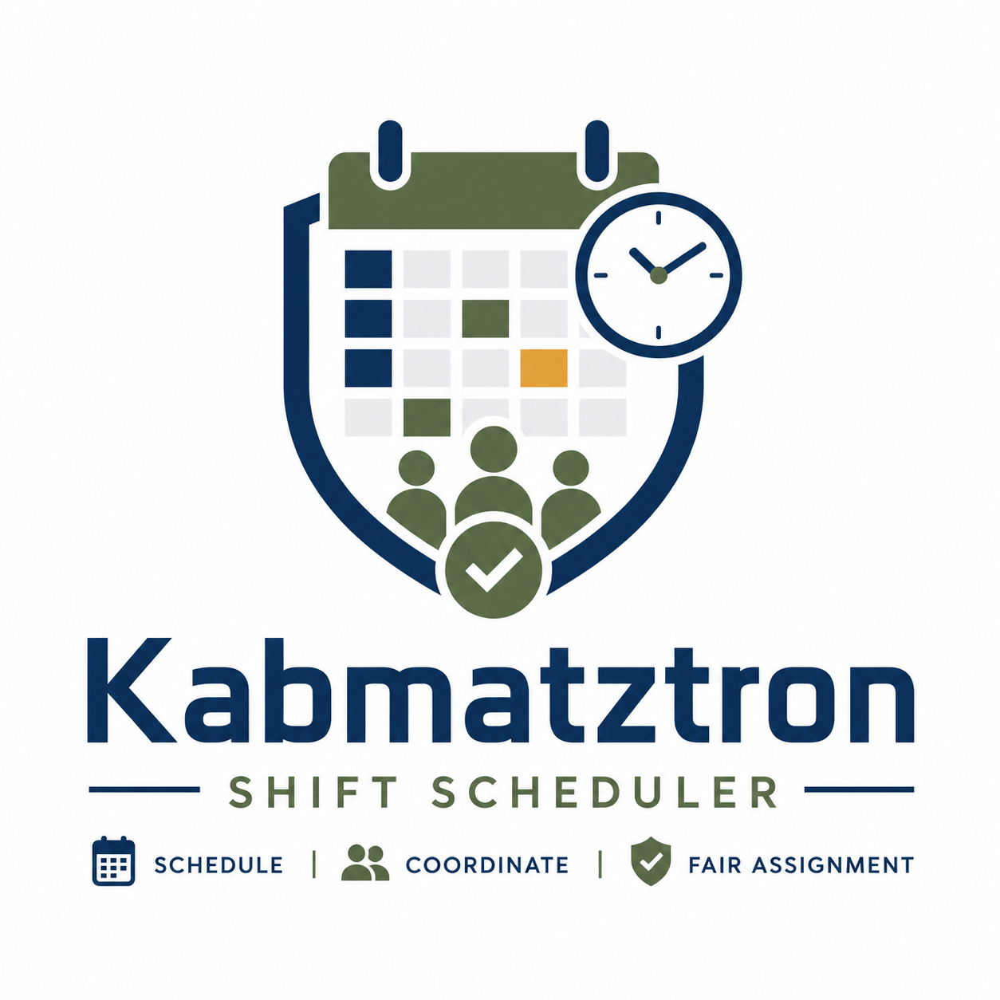

# Kabmatztron

<p align="center">
  
</p>

Kambatztron is a Python-based cadet duty scheduler. The current codebase reads cadets, jobs, and job-compatibility rules from files, validates the data, solves the assignment with OR-Tools CP-SAT, exports an Excel workbook, and writes evaluation artifacts next to the output.

## Current pipeline

```text
CLI args
   │
   ▼
ShiftSchedulerApp
   ├── CadetCSVReader
   ├── JobJSONReader
   └── ConstraintsCSVReader
     │
     ▼
   InputValidator
     │
     ▼
   build_context()
     │
     ▼
   CpsatShiftAssigner
     │
     ▼
   Schedule
     │
     ├── ExcelExporter -> .xlsx workbook or CSV fallback
     └── Evaluator -> evaluation/ CSV, JSON, and PNG files
```

## Inputs

### Cadets CSV

The reader expects these columns:

| Column | Description |
|---|---|
| `personal_number` | Unique identifier for the cadet |
| `name` | Cadet name |
| `unavailable_hours` | Semicolon-separated list of unavailable time slots |
| `forbidden_jobs` | Semicolon-separated list of forbidden job names |
| `gender` | Cadet gender |
| `team` | Cadet team |
| `platoon` | Cadet platoon |

The CSV reader also accepts an optional `forbidden_job_names` column and stores it as an additional forbidden-job list.

### Jobs JSON

The jobs file is a JSON object keyed by job name. Each job entry must contain:

- `job_type`
- `difficulty_by_time_slot`

Every time slot key must use the format `YYYY-MM-DD HH:MM-YYYY-MM-DD HH:MM`, and each difficulty must be numeric and in the range `1` to `10`.

### Constraints CSV

The constraints file is parsed into a bidirectional `ConstraintIndex` with these columns:

| Column | Description |
|---|---|
| `job_type_a` | First job type |
| `job_type_b` | Second job type |
| `can_overlap` | Whether the two job types may overlap |
| `can_be_consecutive` | Whether the two job types may be consecutive |

If no row exists for a job-type pair, the default behavior is that the pair is incompatible.

## Solver behavior

The orchestrator currently uses `CpsatShiftAssigner` from `scheduling/assigner.py`. A greedy assigner still exists in the codebase, but it is not the default path.

The solver works on flattened `Shift` objects built by `build_context()` from the jobs JSON. The context also stores:

- shift ids
- per-shift difficulty and duration maps
- the job-type compatibility matrix `Q`
- the close-shift pair list `E_close`
- the rest-gap parameter `T_rest`
- the penalty weight `rho`

## Output

If the output path ends with `.xlsx`, the exporter writes a workbook with one worksheet per job type plus a `Legend` sheet. Table cells contain cadet names colored by team/platoon combination.

If the output path does not end with `.xlsx`, the exporter falls back to a CSV directory layout for compatibility.

After export, the evaluator writes an `evaluation/` folder next to the output base path with:

- `cadet_stats.csv`
- `summary.json`
- `difficulty_histogram.png`
- `hours_histogram.png`
- `workload_histogram.png`
- `hours_vs_workload.png`

## CLI

```bash
python shift_scheduler.py \
  --cadets cadets.csv \
  --jobs jobs.json \
  --constraints job_constraints.csv \
  --output schedule.xlsx \
  --t-rest 8 \
  --rho 2
```

`--t-rest` controls the rest-gap threshold used when building the close-shift pair set. `--rho` is passed through to the context and evaluator, although the current evaluator uses the workload score formula directly.

## Validation reality

The parser layers currently catch missing files, malformed CSV/JSON, invalid time slots, and invalid difficulty values. The `InputValidator` then checks for duplicate cadet personal numbers, missing cadet names, duplicate job names, and a valid constraints object.

Some of the broader checks described in the earlier requirements are still aspirational rather than enforced in code.
